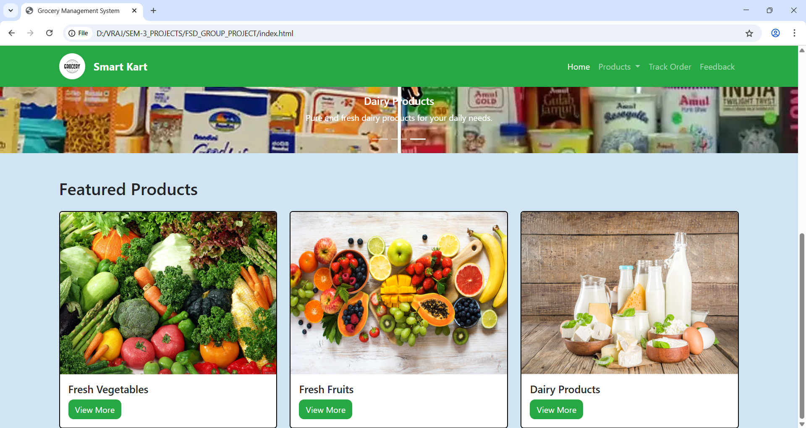
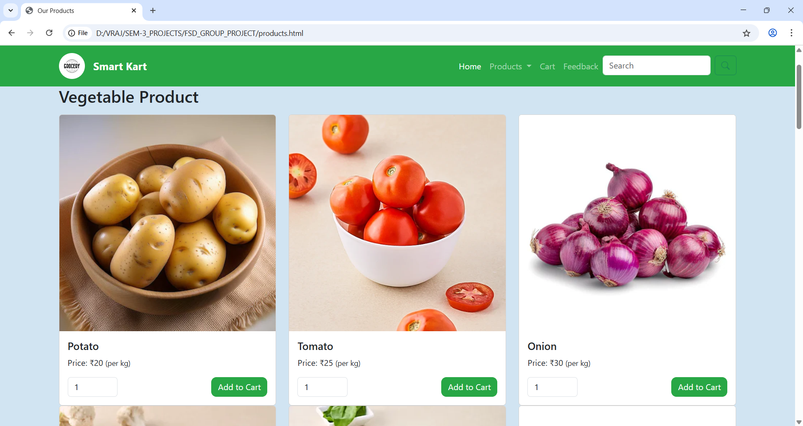
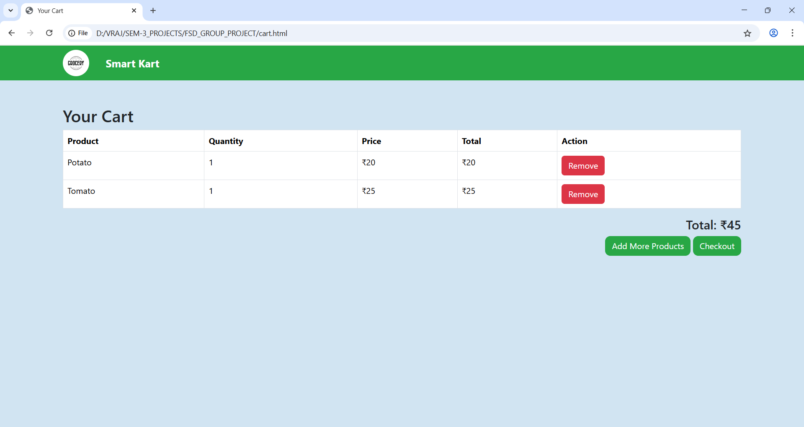
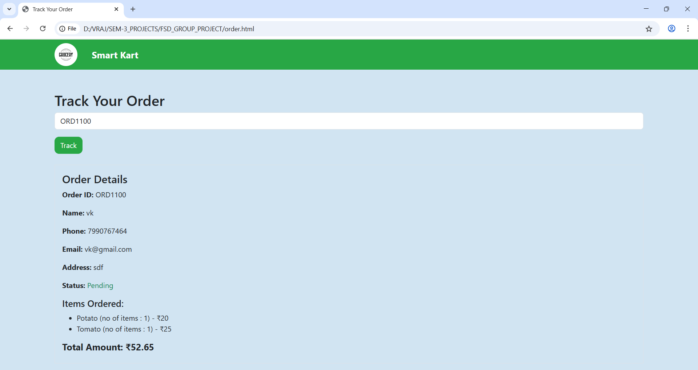

# 🛒 SmartKart – Grocery Management System
SmartKart is a sleek, user-friendly system built for efficient grocery management. Whether it’s tracking stock, updating products, or handling daily inventory tasks, SmartKart simplifies operations with a clean interface and intuitive controls.

# 🚀 Features
- 📦 Product Management – Add, update, or delete grocery items quickly.

- 📊 Inventory Tracking – Stay updated on available stock in real-time.

- 🔍 Search Functionality – Easily find items by name or category.

- 🧾 Order Overview (optional) – View and manage customer orders.

- 💻 Clean UI – Built with HTML, CSS, and JavaScript for a smooth experience.

# 📷 Screenshots
- Home page

- Product page

- Cart page

- Track page

